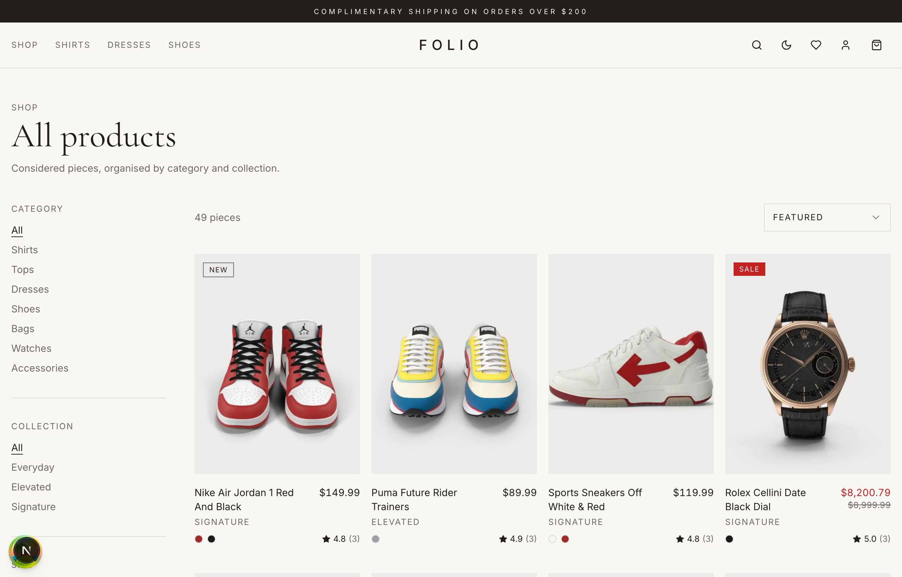
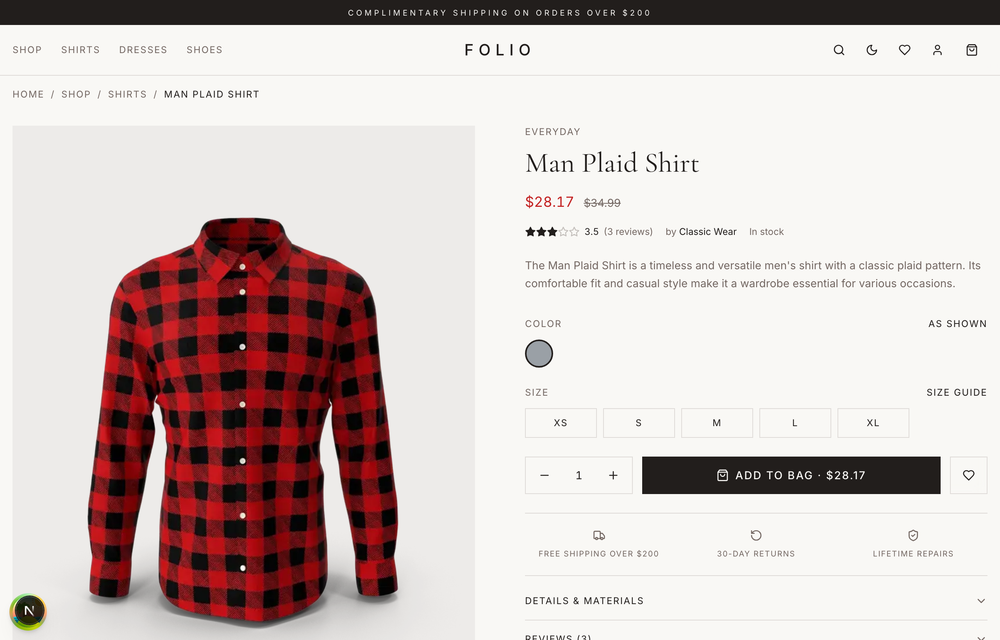

<div align="center">

# FOLIO

### A minimalist, full-stack fashion storefront — built with Next.js 16, Supabase & Stripe.

**[View the live demo →](https://folio-store-plum.vercel.app)**

[](https://github.com/HariYenuganti/folio-store/actions/workflows/ci.yml)
[](#license)

<br />


</div>

A polished, production-leaning e-commerce storefront for a curated multi-brand
fashion edit, built as a portfolio piece to showcase a modern full-stack React
architecture. **It runs out of the box with seeded mock data** — drop in
Supabase + Stripe keys to flip the same storefront onto a real backend with no
code changes.

<p align="center">
  <a href="#whats-inside">Features</a> ·
  <a href="#quick-start">Quick start</a> ·
  <a href="#going-full-stack-supabase--stripe">Full stack</a> ·
  <a href="#architecture-notes">Architecture</a> ·
  <a href="#testing--ci">Testing</a>
</p>


| Shop / PLP                         | Product detail                                  |
| ---------------------------------- | ----------------------------------------------- |
|  |  |

## Tech stack

| Layer         | Tech                                                                         |
| ------------- | ---------------------------------------------------------------------------- |
| Framework     | **Next.js 16** App Router, React 19, Server Components                       |
| Language      | TypeScript 5, strict mode                                                    |
| Styling       | Tailwind CSS 3 + CSS variables, shadcn-style primitives, Radix UI            |
| Database      | **Drizzle ORM** over Postgres (Supabase or any Postgres)                     |
| Auth          | **Supabase Auth** — email/password, password reset, Google OAuth             |
| Payments      | **Stripe Checkout** + webhook order persistence                              |
| Data fetching | **TanStack Query (React Query) v5** — cached client fetching + SSR hydration |
| Search        | **Fuse.js** — typo-tolerant fuzzy search                                     |
| State         | Zustand (cart / wishlist / recently-viewed, persisted to localStorage)       |
| Validation    | Zod (env + catalog + every form, via react-hook-form)                        |
| Testing       | Vitest + Testing Library (unit), Playwright (E2E), GitHub Actions CI         |
| UX            | next-themes (light/dark), Sonner (toasts), Lucide icons                      |
| Deploy        | Vercel                                                                       |

## What's inside

**Storefront**

- **Real product catalog** — seeded from the public DummyJSON API by a
  normalisation script (`npm run catalog`) and baked to JSON so it runs offline:
  real titles, prices, discounts, ratings, reviews and stock across 7 categories.
- **Editorial home** — hero, a diversified "edit", collections lookbook, manifesto.
- **Shop / PLP** — category, collection, brand, size, price and rating filters,
  five sort modes, URL-synced state, and load-more pagination.
- **Search** — ⌘K command palette + a typo-tolerant fuzzy search (`shrt` → shirts).
- **PDP** — image gallery, colour swatches, size picker + size-guide modal,
  breadcrumbs, star ratings, real reviews, out-of-stock gating, related products.

**Commerce**

- **Cart** — slide-out drawer + dedicated page, persisted to localStorage.
- **Checkout** — Stripe Checkout with shipping, promotion codes, and prefill for
  signed-in shoppers (with a mock fallback for zero-config demos).
- **Orders** — recorded server-side from the authoritative Stripe session, via
  both the success page and an idempotent webhook (covers guest / closed-tab);
  order history + a detailed order modal.

**Account & admin**

- **Auth** — email/password with confirmation, password reset, optional Google
  OAuth (with a demo fallback).
- **Account** — editable profile (name + password), orders, a saved-address book
  (add / edit / delete, normalized dedup), and a wishlist. Server-guarded routes.
- **Admin** — a read-only, email-allowlisted dashboard (orders, paid revenue,
  product and low-stock stats).

**Foundations**

- **Theming** light + dark (system-aware), accessible controls, mobile-first responsive.
- **SEO** — sitemap, robots, dynamic OG image, Product + Organization JSON-LD,
  per-route metadata.
- **Reproducible backend** — schema, RLS policies and constraints committed as
  SQL migrations in [`supabase/migrations/`](supabase/migrations).

## Quick start

```bash
git clone https://github.com/HariYenuganti/folio-store.git
cd folio-store
npm install --legacy-peer-deps
npm run dev
```

Open <http://localhost:3000>. You get the full storefront with seeded products,
a working cart and a mock checkout — **no external services required**.

## Going full-stack (Supabase + Stripe)

```bash
cp .env.example .env.local
```

Fill in:

```env
NEXT_PUBLIC_SUPABASE_URL=...
NEXT_PUBLIC_SUPABASE_ANON_KEY=...
SUPABASE_SERVICE_ROLE_KEY=...      # webhook order persistence + /admin
DATABASE_URL=postgres://...        # Supabase connection string (Drizzle)
STRIPE_SECRET_KEY=sk_test_...
NEXT_PUBLIC_STRIPE_PUBLISHABLE_KEY=pk_test_...
STRIPE_WEBHOOK_SECRET=whsec_...    # for /api/webhooks/stripe
```

Then create the schema and seed the catalog. The SQL in
[`supabase/migrations/`](supabase/migrations) is the source of truth — it
creates the `products`, `orders` and `addresses` tables **with their RLS
policies and constraints** (owner-scoped orders/addresses, public-read products,
normalized address dedup). Apply it with the Supabase CLI (`supabase db push`)
or by pasting the files into the Supabase SQL editor in order, then seed:

```bash
npm run db:seed
```

Restart `npm run dev`. The app now uses real Postgres + Supabase Auth, and
checkout redirects to Stripe.

> `npm run db:push` (Drizzle) is also available for a self-hosted Postgres setup
> via `DATABASE_URL`, but it pushes tables only — apply the SQL migrations for
> the RLS policies.

> The wiring is gated entirely on env-var presence — no code changes needed to
> switch between modes. See `src/lib/stripe.ts`, `src/lib/supabase/*`, and
> `src/lib/db/index.ts` for the feature flags.

**Catalog source.** Server code reads the catalog through
`src/lib/data/repository.ts`: when Supabase is configured _and_ the `products`
table has rows, products come from Supabase (read with the anon key via a
public-read RLS policy); otherwise it falls back to the baked `catalog.json`.
The fallback also covers a backend that's unreachable or not yet seeded, so the
storefront never goes down.

## Project layout

```
src/
├── app/                      # App Router routes
│   ├── shop/                 # PLP + PDP
│   ├── cart/ checkout/       # Cart, Stripe checkout + success
│   ├── account/              # Profile, orders, addresses, wishlist (guarded)
│   ├── admin/                # Read-only admin dashboard
│   ├── auth/ sign-in/ …      # Supabase auth + PKCE callback
│   └── api/                  # checkout, products, Stripe webhook
├── components/
│   ├── ui/                   # Radix-powered shadcn primitives
│   └── product-card.tsx product-grid.tsx header.tsx …
├── lib/
│   ├── db/                   # Drizzle schema + client
│   ├── data/                 # Catalog repository + baked seed
│   ├── supabase/             # Server / client / admin wrappers
│   ├── search.ts shipping.ts orders.ts stripe.ts env.ts
├── store/                    # Zustand stores (cart, wishlist, recently-viewed)
└── supabase/migrations/      # SQL schema + RLS (source of truth)
```

## Architecture notes

- **Two data sources, one shape.** Consumers use the same `Product` type whether
  the catalog comes from the in-memory seed or Supabase, so mock and real modes
  are transparent.
- **Env-gated integrations.** Stripe and Supabase activate purely on env-var
  presence — without keys the app serves seeded data and a mock checkout.
- **Authoritative, idempotent orders.** Orders are written from the verified
  Stripe session (not client cart state) by both the success page and the
  webhook, deduped on a unique `stripe_session_id`.
- **Owner-scoped security.** RLS restricts orders/addresses to their owner;
  the webhook and admin use a service-role client; `/admin` is gated by a
  server-side email allowlist.
- **Instant first paint.** Server Components pass their rendered list to TanStack
  Query as `initialData`, so there's no loading flash while React Query owns
  caching and background refetching.

## Testing & CI

```bash
npm run test         # Vitest (cart store, data layer, utils, schema, ProductCard)
npm run test:e2e     # Playwright E2E (browse → add to cart → checkout, search)
npm run lint         # ESLint (flat config, next/core-web-vitals)
npm run typecheck    # tsc --noEmit
npm run format:check # Prettier
```

- **GitHub Actions** ([`ci.yml`](.github/workflows/ci.yml)) runs
  format → lint → typecheck → unit tests → build, plus a separate Playwright job,
  on every push and PR.
- **Pre-commit hook** (husky + lint-staged) runs ESLint + Prettier on staged files.
- **Typed, validated config** — env vars and the product catalog are parsed with
  **zod** at load time, so misconfiguration fails fast with a readable error.

## Scripts

```bash
npm run dev          # Next.js dev server
npm run build        # Production build
npm run start        # Production server
npm run lint         # eslint .
npm run typecheck    # tsc --noEmit
npm run test         # Vitest unit tests
npm run test:e2e     # Playwright end-to-end tests
npm run format       # Prettier write
npm run catalog      # Re-seed catalog.json from the source API
npm run db:push      # Drizzle: push schema to Postgres
npm run db:seed      # Seed catalog into the DB
```

## Credits

- Product data + imagery from the public [DummyJSON](https://dummyjson.com) API
- Editorial photography from [Unsplash](https://unsplash.com)
- UI primitives modeled after [shadcn/ui](https://ui.shadcn.com)
- Icons from [Lucide](https://lucide.dev)

## License

MIT
